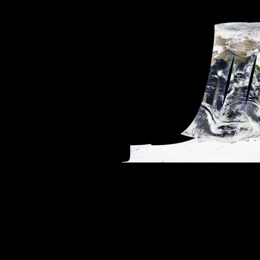

=======================================================
OWSLib |release| documentation
=======================================================

.. toctree::
   :maxdepth: 2

.. image:: https://www.openhub.net/p/owslib/widgets/project_partner_badge.gif
   :width: 193px
   :height: 33px
   :alt: OWSLib
   :target: https://www.openhub.net/p/owslib?ref=WidgetProjectPartnerBadge

:Author: Tom Kralidis
:Contact: tomkralidis at gmail.com
:Release: |release|
:Date: |today|

Introduction
============

OWSLib is a Python package for client programming with `Open Geospatial Consortium`_ (OGC) web service (hence OWS) interface standards, and their related content models.

OWSLib was buried down inside PCL, but has been brought out as a separate project in `r481 <http://trac.gispython.org/lab/changeset/481>`_.

Features
========

Standards Support
-----------------

+-------------------+---------------------+
| Standard          | Version(s)          |
+===================+=====================+
| `OGC WMS`_        | 1.1.1               |
+-------------------+---------------------+
| `OGC WFS`_        | 1.0.0, 1.1.0, 2.0.0 |
+-------------------+---------------------+
| `OGC WCS`_        | 1.0.0, 1.1.0        |
+-------------------+---------------------+
| `OGC WMC`_        | 1.1.0               |
+-------------------+---------------------+
| `OGC SOS`_        | 1.0.0, 2.0.0        |
+-------------------+---------------------+
| `OGC SensorML`_   | 1.0.1               |
+-------------------+---------------------+
| `OGC CSW`_        | 2.0.2               |
+-------------------+---------------------+
| `OGC WPS`_        | 1.0.0               |
+-------------------+---------------------+
| `OGC Filter`_     | 1.1.0               |
+-------------------+---------------------+
| `OGC OWS Common`_ | 1.0.0, 1.1.0, 2.0   |
+-------------------+---------------------+
| `NASA DIF`_       | 9.7                 |
+-------------------+---------------------+
| `FGDC CSDGM`_     | 1998                |
+-------------------+---------------------+
| `ISO 19139`_      | 2007                |
+-------------------+---------------------+
| `Dublin Core`_    | 1.1                 |
+-------------------+---------------------+
| `Swiss GM03`_     | 2.3                 |
+-------------------+---------------------+
| `WMTS`_           | 1.0.0               |
+-------------------+---------------------+
| `WaterML`_        | 1.0, 1.1, 2.0       |
+-------------------+---------------------+

Installation
============

Requirements
------------

OWSLib requires a Python interpreter, as well as `ElementTree <https://docs.python.org/2/library/xml.etree.elementtree.html>`_ or `lxml <http://lxml.de>`_ for XML parsing.

Install
-------

PyPI:

.. code-block:: bash

  $ easy_install OWSLib
  # pip works too
  $ pip install OWSLib

Git:

.. code-block:: bash

  $ git clone git://github.com/geopython/OWSLib.git

Anaconda:

.. note::

   The OWSLib conda packages are **not official** and provided on different conda channels: http://anaconda.org/search?q=type%3Aconda+owslib

.. code-block:: bash

  $ conda install -c birdhouse owslib
  # or
  $ conda install -c ioos owslib

openSUSE:

.. code-block:: bash

  $ zypper ar http://download.opensuse.org/repositories/Application:/Geo/openSUSE_12.1/ GEO
  $ zypper refresh
  $ zypper install owslib

CentOS:

.. code-block:: bash

  $ wget -O /etc/yum.repos.d/CentOS-CBS.repo http://download.opensuse.org/repositories/Application:/Geo/CentOS_6/Application:Geo.repo
  $ yum install owslib

RedHat Enterprise Linux

.. code-block:: bash

  $ wget -O /etc/yum.repos.d/RHEL-CBS.repo http://download.opensuse.org/repositories/Application:/Geo/RHEL_6/Application:Geo.repo
  $ yum install owslib

Fedora:

.. note::

  As of Fedora 20, OWSLib is part of the Fedora core package collection

.. code-block:: bash
  $ yum install OWSLib

Usage
=====

WMS
---

Find out what a WMS has to offer. Service metadata:

.. code-block:: python

  >>> from owslib.wms import WebMapService
  >>> wms = WebMapService('http://wms.jpl.nasa.gov/wms.cgi', version='1.1.1')
  >>> wms.identification.type
  'OGC:WMS'
  >>> wms.identification.title
  'JPL Global Imagery Service'

Available layers:

.. code-block:: python

  >>> list(wms.contents)
  ['global_mosaic', 'global_mosaic_base', 'us_landsat_wgs84', 'srtm_mag', 'daily_terra_721', 'daily_aqua_721', 'daily_terra_ndvi', 'daily_aqua_ndvi', 'daily_terra', 'daily_aqua', 'BMNG', 'modis', 'huemapped_srtm', 'srtmplus', 'worldwind_dem', 'us_ned', 'us_elevation', 'us_colordem']

Details of a layer:

.. code-block:: python

  >>> wms['global_mosaic'].title
  'WMS Global Mosaic, pan sharpened'
  >>> wms['global_mosaic'].queryable
  0
  >>> wms['global_mosaic'].opaque
  0
  >>> wms['global_mosaic'].boundingBox
  >>> wms['global_mosaic'].boundingBoxWGS84
  (-180.0, -60.0, 180.0, 84.0)
  >>> wms['global_mosaic'].crsOptions
  ['EPSG:4326', 'AUTO:42003']
  >>> wms['global_mosaic'].styles
  {'pseudo_bright': {'title': 'Pseudo-color image (Uses IR and Visual bands, 542 mapping), gamma 1.5'}, 'pseudo': {'title': '(default) Pseudo-color image, pan sharpened (Uses IR and Visual bands, 542 mapping), gamma 1.5'}, 'visual': {'title': 'Real-color image, pan sharpened (Uses the visual bands, 321 mapping), gamma 1.5'}, 'pseudo_low': {'title': 'Pseudo-color image, pan sharpened (Uses IR and Visual bands, 542 mapping)'}, 'visual_low': {'title': 'Real-color image, pan sharpened (Uses the visual bands, 321 mapping)'}, 'visual_bright': {'title': 'Real-color image (Uses the visual bands, 321 mapping), gamma 1.5'}}

Available methods, their URLs, and available formats:

.. code-block:: python

  >>> [op.name for op in wms.operations]
  ['GetCapabilities', 'GetMap']
  >>> wms.getOperationByName('GetMap').methods
  {'Get': {'url': 'http://wms.jpl.nasa.gov/wms.cgi?'}}
  >>> wms.getOperationByName('GetMap').formatOptions
  ['image/jpeg', 'image/png', 'image/geotiff', 'image/tiff']

That's everything needed to make a request for imagery:

.. code-block:: python

  >>> img = wms.getmap(   layers=['global_mosaic'],
  ...                     styles=['visual_bright'],
  ...                     srs='EPSG:4326',
  ...                     bbox=(-112, 36, -106, 41),
  ...                     size=(300, 250),
  ...                     format='image/jpeg',
  ...                     transparent=True
  ...                     )
  >>> out = open('jpl_mosaic_visb.jpg', 'wb')
  >>> out.write(img.read())
  >>> out.close()

Result:

.. image:: ../_static/jpl_mosaic_visb.jpg
   :width: 300px
   :height: 250px
   :alt: WMS GetMap generated by OWSLib

WFS
---
Connect to a WFS and inspect its capabilities.

::

    >>> from owslib.wfs import WebFeatureService
    >>> wfs11 = WebFeatureService(url='http://geoserv.weichand.de:8080/geoserver/wfs', version='1.1.0')
    >>> wfs11.identification.title
    'INSPIRE WFS 2.0 DemoServer Verwaltungsgrenzen Bayern

    >>> [operation.name for operation in wfs11.operations]
    ['GetCapabilities', 'DescribeFeatureType', 'GetFeature', 'GetGmlObject']

List FeatureTypes

::

    >>> list(wfs11.contents)
    ['bvv:vg_ex', 'bvv:bayern_ex', 'bvv:lkr_ex', 'bvv:regbez_ex', 'bvv:gmd_ex']

Download GML using ``typename``, ``bbox`` and ``srsname``.

::

    >>> # OWSLib will switch the axis order from EN to NE automatically if designated by EPSG-Registry
    >>> response = wfs11.getfeature(typename='bvv:gmd_ex', bbox=(4500000,5500000,4500500,5500500), srsname='urn:x-ogc:def:crs:EPSG:31468')

Download GML using ``typename`` and ``filter``. OWSLib currently only
support filter building for WFS 1.1 (FE.1.1).

::

    >>> from owslib.fes import *
    >>> from owslib.etree import etree
    >>> from owslib.wfs import WebFeatureService
    >>> wfs11 = WebFeatureService(url='http://geoserv.weichand.de:8080/geoserver/wfs', version='1.1.0')

    >>> filter = PropertyIsLike(propertyname='bez_gem', literal='Ingolstadt', wildCard='*')
    >>> filterxml = etree.tostring(filter.toXML()).decode("utf-8")
    >>> response = wfs11.getfeature(typename='bvv:gmd_ex', filter=filterxml)

Save response to a file.

::

    >>> out = open('/tmp/data.gml', 'wb')
    >>> out.write(bytes(response.read(), 'UTF-8'))
    >>> out.close()

Download GML using ``StoredQueries``\ (only available for WFS 2.0
services)

::

    >>> from owslib.wfs import WebFeatureService
    >>> wfs20 = WebFeatureService(url='http://geoserv.weichand.de:8080/geoserver/wfs', version='2.0.0')

    >>> # List StoredQueries
    >>> [storedquery.id for storedquery in wfs20.storedqueries]
    ['bboxQuery', 'urn:ogc:def:query:OGC-WFS::GetFeatureById', 'GemeindeByGemeindeschluesselEpsg31468', 'DWithinQuery']

    >>> # List Parameters for StoredQuery[1]
    >>> parameter.name for parameter in wfs20.storedqueries[1].parameters]
    ['ID']

    >>> response = wfs20.getfeature(storedQueryID='urn:ogc:def:query:OGC-WFS::GetFeatureById', storedQueryParams={'ID':'gmd_ex.1'})

WCS
---

CSW
---

Connect to a CSW, and inspect its properties:

.. code-block:: python

  >>> from owslib.csw import CatalogueServiceWeb
  >>> csw = CatalogueServiceWeb('http://geodiscover.cgdi.ca/wes/serviceManagerCSW/csw')
  >>> csw.identification.type
  'CSW'
  >>> [op.name for op in csw.operations]
  ['GetCapabilities', 'GetRecords', 'GetRecordById', 'DescribeRecord', 'GetDomain']

Get supported resultType's:

.. code-block:: python

  >>> csw.getdomain('GetRecords.resultType')
  >>> csw.results
  {'values': ['results', 'validate', 'hits'], 'parameter': 'GetRecords.resultType', 'type': 'csw:DomainValuesType'}
  >>>

Search for bird data:

.. code-block:: python

  >>> from owslib.fes import PropertyIsEqualTo, PropertyIsLike, BBox
  >>> birds_query = PropertyIsEqualTo('csw:AnyText', 'birds')
  >>> csw.getrecords2(constraints=[birds_query], maxrecords=20)
  >>> csw.results
  {'matches': 101, 'nextrecord': 21, 'returned': 20}
  >>> for rec in csw.records:
  ...     print(csw.records[rec].title)
  ... 
  ALLSPECIES
  NatureServe Canada References
  Bird Studies Canada - BirdMap WMS
  Parks Canada Geomatics Metadata Repository
  Bird Studies Canada - BirdMap WFS
  eBird Canada - Survey Locations
  WHC CitizenScience WMS
  Project FeederWatch - Survey Locations
  North American Bird Banding and Encounter Database
  Wildlife Habitat Canada CitizenScience WFS
  Parks Canada Geomatics Metadata Repository
  Parks Canada Geomatics Metadata Repository
  Wildlife Habitat Canada CitizenScience WMS
  Canadian IBA Polygon layer
  Land
  Wildlife Habitat Canada CitizenScience WMS
  WATER
  Parks Canada Geomatics Metadata Repository
  Breeding Bird Survey
  SCALE
  >>>

Search for bird data in Canada:

.. code-block:: python

  >>> bbox_query = BBox([-141,42,-52,84])
  >>> csw.getrecords2(constraints=[birds_query, bbox_query])
  >>> csw.results
  {'matches': 3, 'nextrecord': 0, 'returned': 3}
  >>>

Search for keywords like 'birds' or 'fowl'

.. code-block:: python

  >>> birds_query_like = PropertyIsLike('dc:subject', '%birds%')
  >>> fowl_query_like = PropertyIsLike('dc:subject', '%fowl%')
  >>> csw.getrecords2(constraints=[birds_query_like, fowl_query_like])
  >>> csw.results
  {'matches': 107, 'nextrecord': 11, 'returned': 10}
  >>>

Search for a specific record:

.. code-block:: python

  >>> csw.getrecordbyid(id=['9250AA67-F3AC-6C12-0CB9-0662231AA181'])
  >>> c.records['9250AA67-F3AC-6C12-0CB9-0662231AA181'].title
  'ALLSPECIES'

Search with a CQL query

.. code-block:: python

  >>> csw.getrecords(cql='csw:AnyText like "%birds%"')

Transaction: insert

.. code-block:: python

  >>> csw.transaction(ttype='insert', typename='gmd:MD_Metadata', record=open(file.xml).read())

Transaction: update

.. code-block:: python

  >>> # update ALL records
  >>> csw.transaction(ttype='update', typename='csw:Record', propertyname='dc:title', propertyvalue='New Title')
  >>> # update records satisfying keywords filter
  >>> csw.transaction(ttype='update', typename='csw:Record', propertyname='dc:title', propertyvalue='New Title', keywords=['birds','fowl'])
  >>> # update records satisfying BBOX filter
  >>> csw.transaction(ttype='update', typename='csw:Record', propertyname='dc:title', propertyvalue='New Title', bbox=[-141,42,-52,84])

Transaction: delete

.. code-block:: python

  >>> # delete ALL records
  >>> csw.transaction(ttype='delete', typename='gmd:MD_Metadata')
  >>> # delete records satisfying keywords filter
  >>> csw.transaction(ttype='delete', typename='gmd:MD_Metadata', keywords=['birds','fowl'])
  >>> # delete records satisfying BBOX filter
  >>> csw.transaction(ttype='delete', typename='gmd:MD_Metadata', bbox=[-141,42,-52,84])

Harvest a resource

.. code-block:: python

  >>> csw.harvest('http://host/url.xml', 'http://www.isotc211.org/2005/gmd')

WMC
---

WPS
---

Inspect a remote WPS and retrieve the supported processes:

.. code-block:: python

	>>> from owslib.wps import WebProcessingService
	>>> wps = WebProcessingService('http://cida.usgs.gov/climate/gdp/process/WebProcessingService', verbose=False, skip_caps=True)
	>>> wps.getcapabilities()
	>>> wps.identification.type
	'WPS'
	>>> wps.identification.title
	'Geo Data Portal WPS Processing'
	>>> wps.identification.abstract
	'Geo Data Portal WPS Processing'
	>>> for operation in wps.operations:
	...     operation.name
	...
	'GetCapabilities'
	'DescribeProcess'
	'Execute'
	>>> for process in wps.processes:
	...     process.identifier, process.title
	...
	('gov.usgs.cida.gdp.wps.algorithm.FeatureCoverageIntersectionAlgorithm', 'Feature Coverage WCS Intersection')
	('gov.usgs.cida.gdp.wps.algorithm.FeatureCoverageOPeNDAPIntersectionAlgorithm', 'Feature Coverage OPeNDAP Intersection')
	('gov.usgs.cida.gdp.wps.algorithm.FeatureCategoricalGridCoverageAlgorithm', 'Feature Categorical Grid Coverage')
	('gov.usgs.cida.gdp.wps.algorithm.FeatureWeightedGridStatisticsAlgorithm', 'Feature Weighted Grid Statistics')
	('gov.usgs.cida.gdp.wps.algorithm.FeatureGridStatisticsAlgorithm', 'Feature Grid Statistics')
	('gov.usgs.cida.gdp.wps.algorithm.PRMSParameterGeneratorAlgorithm', 'PRMS Parameter Generator')
	>>>

Determine how a specific process needs to be invoked - i.e. what are its input parameters, and output result:

.. code-block:: python

	>>> from owslib.wps import printInputOutput
	>>> process = wps.describeprocess('gov.usgs.cida.gdp.wps.algorithm.FeatureWeightedGridStatisticsAlgorithm')
	>>> process.identifier
	'gov.usgs.cida.gdp.wps.algorithm.FeatureWeightedGridStatisticsAlgorithm'
	>>> process.title
	'Feature Weighted Grid Statistics'
	>>> process.abstract
	'This algorithm generates area weighted statistics of a gridded dataset for a set of vector polygon features. Using the bounding-box that encloses ...
	>>> for input in process.dataInputs:
	...     printInputOutput(input)
	...
	 identifier=FEATURE_COLLECTION, title=Feature Collection, abstract=A feature collection encoded as a WFS request or one of the supported GML profiles.,...
	 Supported Value: mimeType=text/xml, encoding=UTF-8, schema=http://schemas.opengis.net/gml/2.0.0/feature.xsd
	 Supported Value: mimeType=text/xml, encoding=UTF-8, schema=http://schemas.opengis.net/gml/2.1.1/feature.xsd
	 Supported Value: mimeType=text/xml, encoding=UTF-8, schema=http://schemas.opengis.net/gml/2.1.2/feature.xsd
	 Supported Value: mimeType=text/xml, encoding=UTF-8, schema=http://schemas.opengis.net/gml/2.1.2.1/feature.xsd
	 Supported Value: mimeType=text/xml, encoding=UTF-8, schema=http://schemas.opengis.net/gml/3.0.0/base/feature.xsd
	 Supported Value: mimeType=text/xml, encoding=UTF-8, schema=http://schemas.opengis.net/gml/3.0.1/base/feature.xsd
	 Supported Value: mimeType=text/xml, encoding=UTF-8, schema=http://schemas.opengis.net/gml/3.1.0/base/feature.xsd
	 Supported Value: mimeType=text/xml, encoding=UTF-8, schema=http://schemas.opengis.net/gml/3.1.1/base/feature.xsd
	 Supported Value: mimeType=text/xml, encoding=UTF-8, schema=http://schemas.opengis.net/gml/3.2.1/base/feature.xsd
	 Default Value: mimeType=text/xml, encoding=UTF-8, schema=http://schemas.opengis.net/gml/2.0.0/feature.xsd
	 minOccurs=1, maxOccurs=1
	 identifier=DATASET_URI, title=Dataset URI, abstract=The base data web service URI for the dataset of interest., data type=anyURI
	 Allowed Value: AnyValue
	 Default Value: None
	 minOccurs=1, maxOccurs=1
	 identifier=DATASET_ID, title=Dataset Identifier, abstract=The unique identifier for the data type or variable of interest., data type=string
	 Allowed Value: AnyValue
	 Default Value: None
	 minOccurs=1, maxOccurs=2147483647
	 identifier=REQUIRE_FULL_COVERAGE, title=Require Full Coverage, abstract=If turned on, the service will require that the dataset of interest ....
	 Allowed Value: True
	 Default Value: True
	 minOccurs=1, maxOccurs=1
	 identifier=TIME_START, title=Time Start, abstract=The date to begin analysis., data type=dateTime
	 Allowed Value: AnyValue
	 Default Value: None
	 minOccurs=0, maxOccurs=1
	 identifier=TIME_END, title=Time End, abstract=The date to end analysis., data type=dateTime
	 Allowed Value: AnyValue
	 Default Value: None
	 minOccurs=0, maxOccurs=1
	 identifier=FEATURE_ATTRIBUTE_NAME, title=Feature Attribute Name, abstract=The attribute that will be used to label column headers in processing output., ...
	 Allowed Value: AnyValue
	 Default Value: None
	 minOccurs=1, maxOccurs=1
	 identifier=DELIMITER, title=Delimiter, abstract=The delimiter that will be used to separate columns in the processing output., data type=string
	 Allowed Value: COMMA
	 Allowed Value: TAB
	 Allowed Value: SPACE
	 Default Value: COMMA
	 minOccurs=1, maxOccurs=1
	 identifier=STATISTICS, title=Statistics, abstract=Statistics that will be returned for each feature in the processing output., data type=string
	 Allowed Value: MEAN
	 Allowed Value: MINIMUM
	 Allowed Value: MAXIMUM
	 Allowed Value: VARIANCE
	 Allowed Value: STD_DEV
	 Allowed Value: SUM
	 Allowed Value: COUNT
	 Default Value: None
	 minOccurs=1, maxOccurs=7
	 identifier=GROUP_BY, title=Group By, abstract=If multiple features and statistics are selected, this will change whether the processing output ...
	 Allowed Value: STATISTIC
	 Allowed Value: FEATURE_ATTRIBUTE
	 Default Value: None
	 minOccurs=1, maxOccurs=1
	 identifier=SUMMARIZE_TIMESTEP, title=Summarize Timestep, abstract=If selected, processing output will include columns with summarized statistics ...
	 Allowed Value: True
	 Default Value: True
	 minOccurs=0, maxOccurs=1
	 identifier=SUMMARIZE_FEATURE_ATTRIBUTE, title=Summarize Feature Attribute, abstract=If selected, processing output will include a final row of ...
	 Allowed Value: True
	 Default Value: True
	 minOccurs=0, maxOccurs=1
	>>> for output in process.processOutputs:
	...     printInputOutput(output)
	...
	 identifier=OUTPUT, title=Output File, abstract=A delimited text file containing requested process output., data type=ComplexData
	 Supported Value: mimeType=text/csv, encoding=UTF-8, schema=None
	 Default Value: mimeType=text/csv, encoding=UTF-8, schema=None
	 reference=None, mimeType=None
	>>>

Submit a processing request (extraction of a climate index variable over a specific GML polygon, for a given period of time), monitor the execution until complete:

.. code-block:: python

	>>> from owslib.wps import GMLMultiPolygonFeatureCollection
	>>> polygon = [(-102.8184, 39.5273), (-102.8184, 37.418), (-101.2363, 37.418), (-101.2363, 39.5273), (-102.8184, 39.5273)]
	>>> featureCollection = GMLMultiPolygonFeatureCollection( [polygon] )
	>>> processid = 'gov.usgs.cida.gdp.wps.algorithm.FeatureWeightedGridStatisticsAlgorithm'
	>>> inputs = [ ("FEATURE_ATTRIBUTE_NAME","the_geom"),
	...            ("DATASET_URI", "dods://cida.usgs.gov/qa/thredds/dodsC/derivatives/derivative-days_above_threshold.pr.ncml"),
	...            ("DATASET_ID", "ensemble_b1_pr-days_above_threshold"),
	...            ("TIME_START","2010-01-01T00:00:00.000Z"),
	...            ("TIME_END","2011-01-01T00:00:00.000Z"),
	...            ("REQUIRE_FULL_COVERAGE","false"),
	...            ("DELIMITER","COMMA"),
	...            ("STATISTICS","MEAN"),
	...            ("GROUP_BY","STATISTIC"),
	...            ("SUMMARIZE_TIMESTEP","false"),
	...            ("SUMMARIZE_FEATURE_ATTRIBUTE","false"),
	...            ("FEATURE_COLLECTION", featureCollection)
	...           ]
	>>> output = "OUTPUT"
	>>> execution = wps.execute(processid, inputs, output = "OUTPUT")
	Executing WPS request...
	Execution status=ProcessStarted
	>>> from owslib.wps import monitorExecution
	>>> monitorExecution(execution)

	Checking execution status... (location=http://cida.usgs.gov/climate/gdp/process/RetrieveResultServlet?id=6809217153012787208)
	Execution status=ProcessSucceeded
	Execution status: ProcessSucceeded
	Output URL=http://cida.usgs.gov/climate/gdp/process/RetrieveResultServlet?id=6809217153012787208OUTPUT.3cbcd666-a912-456f-84a3-6ede450aca95
	>>>

Alternatively, define the feature through an embedded query to a WFS server:

.. code-block:: python

	>>> from owslib.wps import WFSQuery, WFSFeatureCollection
	>>> wfsUrl = "http://cida.usgs.gov/climate/gdp/proxy/http://igsarm-cida-gdp2.er.usgs.gov:8082/geoserver/wfs"
	>>> query = WFSQuery("sample:CONUS_States", propertyNames=['the_geom',"STATE"], filters=["CONUS_States.508","CONUS_States.469"])
	>>> featureCollection = WFSFeatureCollection(wfsUrl, query)
	>>> # same process submission as above
	...

You can also submit a pre-made request encoded as WPS XML:

.. code-block:: python

	>>> request = open('/Users/cinquini/Documents/workspace-cog/wps/tests/resources/wps_USGSExecuteRequest1.xml','rb').read()
	>>> execution = wps.execute(None, [], request=request)
	Executing WPS request...
	Execution status=ProcessStarted
	>>> monitorExecution(execution)

	Checking execution status... (location=http://cida.usgs.gov/climate/gdp/process/RetrieveResultServlet?id=5103866488472745994)
	Execution status=ProcessSucceeded
	Execution status: ProcessSucceeded
	Output URL=http://cida.usgs.gov/climate/gdp/process/RetrieveResultServlet?id=5103866488472745994OUTPUT.f80e2a78-96a9-4343-9777-be60fac5b256

SOS 1.0
-------

GetCapabilities

.. include:: ../../tests/doctests/sos_10_getcapabilities.txt

GetObservation

.. include:: ../../tests/doctests/sos_10_ndbc_getobservation.txt

SOS 2.0
-------
Examples of service metadata and GetObservation

.. include:: ../../tests/doctests/sos_20_52n_geoviqua.txt

Using the GetObservation response decoder for O&M and WaterML2.0 results

.. include:: ../../tests/doctests/sos_20_timeseries_decoder_ioos.txt

SensorML
--------
.. include:: ../../tests/doctests/sml_ndbc_station.txt

ISO
---

.. code-block:: python

  >>> from owslib.iso import *
  >>> m=MD_Metadata(etree.parse('tests/resources/9250AA67-F3AC-6C12-0CB9-0662231AA181_iso.xml'))
  >>> m.identification.topiccategory
  'farming'
  >>>

ISO Codelists:

.. include:: ../../tests/doctests/iso_codelist.txt

CRS Handling
------------

.. include:: ../../tests/doctests/crs.txt

Dublin Core
-----------

NASA DIF
--------

FGDC
----

Swiss GM03
----------

.. include:: ../../tests/doctests/gm03_parse.txt

WMTS
----

.. include:: ../../tests/doctests/wmts.txt

Result:

WaterML
-------

.. include:: ../../tests/doctests/wml11_cuahsi.txt

Development
===========

The OWSLib wiki is located at https://github.com/geopython/OWSLib/wiki

The OWSLib source code is available at https://github.com/geopython/OWSLib

You can find out about software metrics at the OWSLib ohloh page at http://www.ohloh.net/p/OWSLib.

Testing
-------

.. code-block:: bash

   $ python setup.py test

Or ...

.. code-block:: bash

    # install requirements
    $ pip install -r requirements.txt
    $ pip install -r requirements-dev.txt # needed for tests only

    # run tests
    python -m pytest

    # additional pep8 tests
    pep8 owslib/wmts.py

Support
=======

Mailing Lists
-------------

OWSLib provides users and developers mailing lists.  Subscription options and archives are available at http://lists.osgeo.org/mailman/listinfo/owslib-users and http://lists.osgeo.org/mailman/listinfo/owslib-devel.

Submitting Questions to Community
---------------------------------

To submit questions to a mailing list, first join the list by following the subscription procedure above. Then post questions to the list by sending an email message to either owslib-users@lists.osgeo.org or owslib-devel@lists.osgeo.org.

Searching the Archives
----------------------

All Community archives are located in http://lists.osgeo.org/pipermail/owslib-users/ http://lists.osgeo.org/pipermail/owslib-devel/

Metrics
-------

You can find out about software metrics at the OWSLib `ohloh`_ page.

IRC
---

As well, visit OWSLib on IRC on ``#geopython`` at `freenode`_ for realtime discussion.

Logging
=======

OWSLib logs messages to the 'owslib' named python logger.  You may configure your
application to use the log messages like so:

.. code-block:: python

    import logging
    owslib_log = logging.getLogger('owslib')
    # Add formatting and handlers as needed
    owslib_log.setLevel(logging.DEBUG)

License
=======

Copyright (c) 2006, Ancient World Mapping Center
All rights reserved.

Redistribution and use in source and binary forms, with or without
modification, are permitted provided that the following conditions are met:

    * Redistributions of source code must retain the above copyright
      notice, this list of conditions and the following disclaimer.
    * Redistributions in binary form must reproduce the above copyright
      notice, this list of conditions and the following disclaimer in the
      documentation and/or other materials provided with the distribution.
    * Neither the name of the University of North Carolina nor the names of
      its contributors may be used to endorse or promote products derived
      from this software without specific prior written permission.

THIS SOFTWARE IS PROVIDED BY THE COPYRIGHT HOLDERS AND CONTRIBUTORS "AS IS"
AND ANY EXPRESS OR IMPLIED WARRANTIES, INCLUDING, BUT NOT LIMITED TO, THE
IMPLIED WARRANTIES OF MERCHANTABILITY AND FITNESS FOR A PARTICULAR PURPOSE
ARE DISCLAIMED. IN NO EVENT SHALL THE COPYRIGHT OWNER OR CONTRIBUTORS BE
LIABLE FOR ANY DIRECT, INDIRECT, INCIDENTAL, SPECIAL, EXEMPLARY, OR
CONSEQUENTIAL DAMAGES (INCLUDING, BUT NOT LIMITED TO, PROCUREMENT OF
SUBSTITUTE GOODS OR SERVICES; LOSS OF USE, DATA, OR PROFITS; OR BUSINESS
INTERRUPTION) HOWEVER CAUSED AND ON ANY THEORY OF LIABILITY, WHETHER IN
CONTRACT, STRICT LIABILITY, OR TORT (INCLUDING NEGLIGENCE OR OTHERWISE)
ARISING IN ANY WAY OUT OF THE USE OF THIS SOFTWARE, EVEN IF ADVISED OF THE
POSSIBILITY OF SUCH DAMAGE.

Credits
=======

.. include:: ../../CREDITS.txt

.. _`Open Geospatial Consortium`: http://www.opengeospatial.org/
.. _`OGC WMS`: http://www.opengeospatial.org/standards/wms
.. _`OGC WFS`: http://www.opengeospatial.org/standards/wfs
.. _`OGC WCS`: http://www.opengeospatial.org/standards/wcs
.. _`OGC WMC`: http://www.opengeospatial.org/standards/wmc
.. _`OGC WPS`: http://www.opengeospatial.org/standards/wps
.. _`OGC SOS`: http://www.opengeospatial.org/standards/sos
.. _`OGC O&M`: http://www.opengeospatial.org/standards/om
.. _`OGC WaterML2.0`: http://www.opengeospatial.org/standards/waterml
.. _`OGC SensorML`: http://www.opengeospatial.org/standards/sensorml
.. _`OGC CSW`: http://www.opengeospatial.org/standards/cat
.. _`OGC WMTS`: http://www.opengeospatial.org/standards/wmts
.. _`OGC Filter`: http://www.opengeospatial.org/standards/filter
.. _`OGC OWS Common`: http://www.opengeospatial.org/standards/common
.. _`NASA DIF`: http://gcmd.nasa.gov/User/difguide/
.. _`FGDC CSDGM`: http://www.fgdc.gov/metadata/csdgm
.. _`ISO 19115`: http://www.iso.org/iso/catalogue_detail.htm?csnumber=26020
.. _`ISO 19139`: http://www.iso.org/iso/catalogue_detail.htm?csnumber=32557
.. _`Dublin Core`: http://www.dublincore.org/
.. _`freenode`: http://freenode.net/
.. _`ohloh`: http://www.ohloh.net/p/OWSLib
.. _`CIA.vc`: http://cia.vc/stats/project/OWSLib
.. _`WaterML`: http://his.cuahsi.org/wofws.html#waterml
.. _`Swiss GM03`: http://www.geocat.ch/internet/geocat/en/home/documentation/gm03.html
