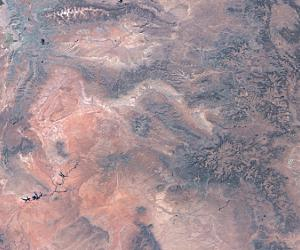
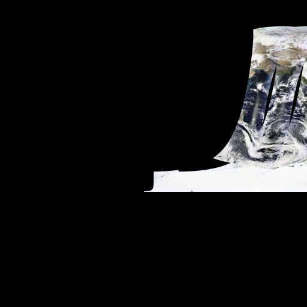

Usage
=====

WMS
---

Find out what a WMS has to offer. Service metadata:

.. code-block:: python

  >>> from owslib.wms import WebMapService
  >>> wms = WebMapService('http://wms.jpl.nasa.gov/wms.cgi', version='1.1.1')
  >>> wms.identification.type
  'OGC:WMS'
  >>> wms.identification.version
  '1.1.1'
  >>> wms.identification.title
  'JPL Global Imagery Service'
  >>> wms.identification.abstract
  'WMS Server maintained by JPL, worldwide satellite imagery.'

Available layers:

.. code-block:: python

  >>> list(wms.contents)
  ['global_mosaic', 'global_mosaic_base', 'us_landsat_wgs84', 'srtm_mag', 'daily_terra_721', 'daily_aqua_721', 'daily_terra_ndvi', 'daily_aqua_ndvi', 'daily_terra', 'daily_aqua', 'BMNG', 'modis', 'huemapped_srtm', 'srtmplus', 'worldwind_dem', 'us_ned', 'us_elevation', 'us_colordem']

Details of a layer:

.. code-block:: python

  >>> wms['global_mosaic'].title
  'WMS Global Mosaic, pan sharpened'
  >>> wms['global_mosaic'].queryable
  0
  >>> wms['global_mosaic'].opaque
  0
  >>> wms['global_mosaic'].boundingBox
  >>> wms['global_mosaic'].boundingBoxWGS84
  (-180.0, -60.0, 180.0, 84.0)
  >>> wms['global_mosaic'].crsOptions
  ['EPSG:4326', 'AUTO:42003']
  >>> wms['global_mosaic'].styles
  {'pseudo_bright': {'title': 'Pseudo-color image (Uses IR and Visual bands, 542 mapping), gamma 1.5'}, 'pseudo': {'title': '(default) Pseudo-color image, pan sharpened (Uses IR and Visual bands, 542 mapping), gamma 1.5'}, 'visual': {'title': 'Real-color image, pan sharpened (Uses the visual bands, 321 mapping), gamma 1.5'}, 'pseudo_low': {'title': 'Pseudo-color image, pan sharpened (Uses IR and Visual bands, 542 mapping)'}, 'visual_low': {'title': 'Real-color image, pan sharpened (Uses the visual bands, 321 mapping)'}, 'visual_bright': {'title': 'Real-color image (Uses the visual bands, 321 mapping), gamma 1.5'}}

Available methods, their URLs, and available formats:

.. code-block:: python

  >>> [op.name for op in wms.operations]
  ['GetCapabilities', 'GetMap']
  >>> wms.getOperationByName('GetMap').methods
  {'Get': {'url': 'http://wms.jpl.nasa.gov/wms.cgi?'}}
  >>> wms.getOperationByName('GetMap').formatOptions
  ['image/jpeg', 'image/png', 'image/geotiff', 'image/tiff']

That's everything needed to make a request for imagery:

.. code-block:: python

  >>> img = wms.getmap(   layers=['global_mosaic'],
  ...                     styles=['visual_bright'],
  ...                     srs='EPSG:4326',
  ...                     bbox=(-112, 36, -106, 41),
  ...                     size=(300, 250),
  ...                     format='image/jpeg',
  ...                     transparent=True
  ...                     )
  >>> out = open('jpl_mosaic_visb.jpg', 'wb')
  >>> out.write(img.read())
  >>> out.close()

Result:

WFS
---
Connect to a WFS and inspect its capabilities.

::

    >>> from owslib.wfs import WebFeatureService
    >>> wfs11 = WebFeatureService(url='http://geoserv.weichand.de:8080/geoserver/wfs', version='1.1.0')
    >>> wfs11.identification.title
    'INSPIRE WFS 2.0 DemoServer Verwaltungsgrenzen Bayern

    >>> [operation.name for operation in wfs11.operations]
    ['GetCapabilities', 'DescribeFeatureType', 'GetFeature', 'GetGmlObject']

List FeatureTypes

::

    >>> list(wfs11.contents)
    ['bvv:vg_ex', 'bvv:bayern_ex', 'bvv:lkr_ex', 'bvv:regbez_ex', 'bvv:gmd_ex']

Download GML using ``typename``, ``bbox`` and ``srsname``.

::

    >>> # OWSLib will switch the axis order from EN to NE automatically if designated by EPSG-Registry
    >>> response = wfs11.getfeature(typename='bvv:gmd_ex', bbox=(4500000,5500000,4500500,5500500), srsname='urn:x-ogc:def:crs:EPSG:31468')

Return a FeatureType's schema via ``DescribeFeatureType``. The dictionary returned is
compatible with a `Fiona schema object <https://fiona.readthedocs.io/en/latest/fiona.html#fiona.collection.Collection.schema>`_.

::

    >>> wfs11.get_schema('bvv:vg_ex')
    >>> {'properties': {'land': 'string', 'modellart': 'string', 'objart': 'string', 'objart_txt': 'string', 'objid': 'string', 'hdu_x': 'short', 'beginn': 'string', 'ende': 'string', 'adm': 'string', 'avg': 'string', 'bez_gem': 'string', 'bez_krs': 'string', 'bez_lan': 'string', 'bez_rbz': 'string', 'sch': 'string'}, 'geometry': '3D MultiPolygon', 'geometry_column': 'geom'}

Download GML using ``typename`` and ``filter``. OWSLib currently only
support filter building for WFS 1.1 (FE.1.1).

::

    >>> from owslib.fes import *
    >>> from owslib.etree import etree
    >>> from owslib.wfs import WebFeatureService
    >>> wfs11 = WebFeatureService(url='http://geoserv.weichand.de:8080/geoserver/wfs', version='1.1.0')

    >>> filter = PropertyIsLike(propertyname='bez_gem', literal='Ingolstadt', wildCard='*')
    >>> filterxml = etree.tostring(filter.toXML()).decode("utf-8")
    >>> response = wfs11.getfeature(typename='bvv:gmd_ex', filter=filterxml)

Save response to a file.

::

    >>> out = open('/tmp/data.gml', 'wb')
    >>> out.write(bytes(response.read(), 'UTF-8'))
    >>> out.close()

Download GML using ``StoredQueries``\ (only available for WFS 2.0
services)

::

    >>> from owslib.wfs import WebFeatureService
    >>> wfs20 = WebFeatureService(url='http://geoserv.weichand.de:8080/geoserver/wfs', version='2.0.0')

    >>> # List StoredQueries
    >>> [storedquery.id for storedquery in wfs20.storedqueries]
    ['bboxQuery', 'urn:ogc:def:query:OGC-WFS::GetFeatureById', 'GemeindeByGemeindeschluesselEpsg31468', 'DWithinQuery']

    >>> # List Parameters for StoredQuery[1]
    >>> parameter.name for parameter in wfs20.storedqueries[1].parameters]
    ['ID']

    >>> response = wfs20.getfeature(storedQueryID='urn:ogc:def:query:OGC-WFS::GetFeatureById', storedQueryParams={'ID':'gmd_ex.1'})

OGC API
-------

The `OGC API`_ standards are a clean break from the traditional OGC service architecture
using current design patterns (RESTful, JSON, OpenAPI).  As such, OWSLib the code follows
the same pattern.

OGC API - Features - Part 1: Core 1.0
^^^^^^^^^^^^^^^^^^^^^^^^^^^^^^^^^^^^^

.. code-block:: python

  >>> from owslib.ogcapi.features import Features
  >>> w = Features('https://demo.pygeoapi.io/master')
  >>> w.url
  'https://demo.pygeoapi.io/master'
  >>> conformance = w.conformance()
  {u'conformsTo': [u'http://www.opengis.net/spec/ogcapi-features-1/1.0/conf/core', u'http://www.opengis.net/spec/ogcapi-features-1/1.0/conf/oas30', u'http://www.opengis.net/spec/ogcapi-features-1/1.0/conf/html', u'http://www.opengis.net/spec/ogcapi-features-1/1.0/conf/geojson']}
  >>> api = w.api()  # OpenAPI document/
  >>> collections = w.collections()
  >>> len(collections['collections'])
  13
  >>> feature_collections = w.feature_collections()
  >>> len(feature_collections)
  13
  >>> lakes = w.collection('lakes')
  >>> lakes['id']
  'lakes'
  >>> lakes['title']
  'Large Lakes'
  >>> lakes['description']
  'lakes of the world, public domain'
  >>> lakes_queryables = w.collection_queryables('lakes')
  >>> len(lakes_queryables['queryables'])
  6
  >>> lakes_query = w.collection_items('lakes')
  >>> lakes_query['features'][0]['properties']
  {u'scalerank': 0, u'name_alt': None, u'admin': None, u'featureclass': u'Lake', u'id': 0, u'name': u'Lake Baikal'}

OGC API - Coverages - Part 1: Core 1.0
^^^^^^^^^^^^^^^^^^^^^^^^^^^^^^^^^^^^^^

.. code-block:: python

  >>> from owslib.ogcapi.coverages import Coverages
  >>> w = Coverages('https://dev.api.weather.gc.ca/coverages-demo')
  >>> w.url
  'https://dev.api.weather.gc.ca/coverages-demo/')
  >>> api = w.api()  # OpenAPI document
  >>> collections = w.collections()
  >>> len(collections['collections'])
  3
  >>> coverages = w.coverages()
  >>> len(coverages)
  1
  >>> gdps = w.collection('gdps-temperature')
  >>> gdps['id']
  'gdps-temperature'
  >>> gdps['title']
  Global Deterministic Prediction System sample'
  >>> gdps['description']
  'Global Deterministic Prediction System sample'
  >>> gdps['extent']['spatial']['grid'][0]
  >>> {"cellsCount": 2400, "resolution": 0.15000000000000002 }
  >>> gdps['extent']['spatial']['grid'][1]
  >>> {"cellsCount": 1201, "resolution": 0.15}
  >>> schema = w.collection_schema('gdps-temperature')
  >>> len(schema['properties'])
  1
  >>> schema['properties']['1']['type']
  'number'
  >> gdps_coverage_data = w.coverage('gdps-temperature', range_subset=[1])

OGC API - Records - Part 1: Core 1.0
^^^^^^^^^^^^^^^^^^^^^^^^^^^^^^^^^^^^

  >>> from owslib.ogcapi.records import Records
  >>> w = Records('https://example.org/records-api')
  >>> w.url
  'https://example.org/records-api'
  >>> conformance = w.conformance()
  {'conformsTo': [u'http://www.opengis.net/spec/ogcapi-features-1/1.0/conf/core', u'http://www.opengis.net/spec/ogcapi-features-1/1.0/conf/oas30', u'http://www.opengis.net/spec/ogcapi-features-1/1.0/conf/html', u'http://www.opengis.net/spec/ogcapi-features-1/1.0/conf/geojson', u'http://www.opengis.net/spec/ogcapi-records-1/1.0/req/core', u'http://www.opengis.net/spec/ogcapi-records/1.0/req/oas30', u'http://www.opengis.net/spec/ogcapi-records-1/1.0/req/json', u'http://www.opengis.net/spec/ogcapi-records-1/1.0/req/html']}
  >>> api = w.api()  # OpenAPI document
  >>> collections = w.collections()
  >>> len(collections)
  1
  >>> records = w.records()
  >>> len(records)
  1
  >>> my_catalogue = w.collection('my-catalogue')
  >>> my_catalogue['id']
  'my-catalogue'
  >>> my_catalogue['title']
  'My catalogue'
  >>> my_catalogue['description']
  'My catalogue'
  >>> my_catalogue_queryables = w.collection_queryables('my-catalogue')
  >>> len(my_catalogue_queryables)
  8
  >>> my_catalogue_query = w.collection_items('my-catalogue')
  >>> my_catalogue_query['features'][0]['properties'].keys()
  [u'title', u'abstract', u'keywords']
  >>> my_catalogue_query['features'][0]['properties']['title']
  u'Roadrunner ambush locations'
  >>> my_catalogue_query2 = w.collection_items('my-catalogue', q='birds')
  >>> msc_wis_dcpc_query2['numberMatched']
  2
  >>> msc_wis_dcpc_query2['numberReturned']
  2
  >>> my_catalogue_cql_text_query = w.collection_items('my-catalogue', filter="title LIKE 'Roadrunner%'")
  >>> my_catalogue_cql_text_query['features'][0]['properties']['title']
  u'Roadrunner ambush locations'
  >>> my_catalogue_cql_json_query = w.collection_items('my-catalogue', limit=1, cql={'eq': [{ 'property': 'title' }, 'Roadrunner ambush locations']})
  >>> my_catalogue_cql_json_query['features'][0]['properties']['title']
  u'Roadrunner ambush locations'

  >>> import json

  >>> record_data = 'sample-geojson-record.json'

  >>> with open(record_data) as fh:
  ..  data = json.load(fh)

  >>> identifier = data['id']

  >>> w.collection_item_create('my-catalogue', data)

  >>> w.collection_item_update('my-catalogue', identifier, data)

  >>> w.collection_item_delete('my-catalogue', identifier)

OGC API - Features - Part 4: Create, Replace, Update and Delete
^^^^^^^^^^^^^^^^^^^^^^^^^^^^^^^^^^^^^^^^^^^^^^^^^^^^^^^^^^^^^^^

.. note::

   This specification applies to both OGC API - Features and OGC API - Records

.. code-block:: python

   >>> import json
   >>> from owslib.ogcapi.records import Records

   >>> record_data = '/path/to/record.json'

   >>> url = 'http://localhost:8000'
   >>> collection_id = 'metadata:main'

   >>> r = Records(url)

   >>> cat = r.collection(collection_id)

   >>> with open(record_data) as fh:
   ...    data = json.load(fh)

   >>> identifier = data['id']

   >>> r.collection_item_delete(collection_id, identifier)

   # insert metadata
   >>> r.collection_item_create(collection_id, data)

   # update metadata
   >>> r.collection_item_update(collection_id, identifier, data)

   # delete metadata
   >>> r.collection_item_delete(collection_id, identifier)

OGC API - Processes - Part 1: Core 1.0
^^^^^^^^^^^^^^^^^^^^^^^^^^^^^^^^^^^^^^

.. code-block:: python

  >>> from owslib.ogcapi.processes import Processes
  >>> p = Processes(SERVICE_URL)

  >>> processes = p.processes()
  >>>  hello_world = p.process('hello-world')

  >>> hello_world['id']
  'hello-world'
  >>> hello_world['title']
  'Hello World'

  >>> result = p.execute('hello-world', inputs={'name': 'World', 'message': 'Testing from OWSLib'})
  >>> result
  {'outputs': [{'id': 'echo', 'value': 'Hello World! Testing from OWSLib'}]}

OGC API - Maps - Part 1: Core 1.0
^^^^^^^^^^^^^^^^^^^^^^^^^^^^^^^^^

.. code-block:: python

  >>> from owslib.ogcapi.maps import Maps
  >>> m = Maps('http://localhost:5000')
  >>> lakes = m.collection('lakes')
  >>> data = m.map('lakes', width=1200, height=800, transparent=False)
  >>> with open("output.png", "wb") as fh:
  ...     fh.write(data.getbuffer())

OGC API - Environmental Data Retrieval - Part 1: Core 1.0
^^^^^^^^^^^^^^^^^^^^^^^^^^^^^^^^^^^^^^^^^^^^^^^^^^^^^^^^^

.. code-block:: python

  >>> from owslib.ogcapi.edr import EnvironmentalDataRetrieval
  >>> e = EnvironmentalDataRetrieval('http://localhost:5000')
  >>> icoads_sst = m.collection('icoads-sst')
  >>> data = e.query_data('icoads_sst', 'position', coords='POINT(-75 45)', parameter_names=['SST', 'AIRT'])

OGC API - Connected Systems -  Part 1: Feature Resources & Part 2: Dynamic Data
^^^^^^^^^^^^^^^^^^^^^^^^^^^^^^^^^^^^^^^^^^^^^^^^^^^^^^^^^^^^^^^^^^^^^^^^^^^^^^^

.. note::
    The library covers all of parts 1 and 2, the example below is a short overview of the functionality.
    All CRUD operations are performed in a very similar manner. Please see the Connected Systems API docs
    for the full lists of properties, encoding requirements and expected responses.

.. code-block:: python

 >>> from owslib.ogcapi.connectedsystems import Systems, Datastreams, Observations
 >>> s = Systems('http://localhost:5000', auth=('user', 'password'), headers={'Content-Type': 'application/sml+json'})
 >>> ds = Datastreams('http://localhost:5000', auth=('user', 'password'), headers={'Content-Type': 'application/json'})
 >>> obs = Observations('http://localhost:5000', auth=('user', 'password'), headers={'Content-Type': 'application/json'})
 # insert a new system, datastream and observation
 >>> system_info =  {
 >>>     "type": "SimpleProcess",
 >>>     "uniqueId": "urn:osh:sensor:testsmlsensor:001",
 >>>     "label": "Test SML Sensor",
 >>>     "description": "A Sensor created from an SML document",
 >>>     "definition": "http://www.w3.org/ns/ssn/Sensor"
 >>> }
 >>> ds_definition = {
 >>>        "name": "Test Datastream",
 >>>        "outputName": "Test Output #1",
 >>>        "schema": {
 >>>            "obsFormat": "application/swe+json",
 >>>            "encoding": {
 >>>                "type": "JSONEncoding",
 >>>                "vectorAsArrays": False
 >>>            },
 >>>            "recordSchema": {
 >>>                "type": "DataRecord",
 >>>                "label": "Test Datastream Record",
 >>>                "updatable": False,
 >>>                "optional": False,
 >>>                "definition": "http://test.com/Record",
 >>>                "fields": [
 >>>                   {
 >>>                       "type": "Time",
 >>>                       "label": "Test Datastream Time",
 >>>                       "updatable": False,
 >>>                       "optional": False,
 >>>                       "definition": "http://test.com/Time",
 >>>                       "name": "timestamp",
 >>>                       "uom": {
 >>>                           "href": "http://test.com/TimeUOM"
 >>>                       }
 >>>                   },
 >>>                   {
 >>>                       "type": "Boolean",
 >>>                       "label": "Test Datastream Boolean",
 >>>                       "updatable": False,
 >>>                       "optional": False,
 >>>                       "definition": "http://test.com/Boolean",
 >>>                       "name": "testboolean"
 >>>                   }
 >>>               ]
 >>>           }
 >>>       }
 >>>   }
 >>> observation = {
 >>>            "phenomenonTime": the_time,
 >>>            "resultTime": the_time,
 >>>            "result": {
 >>>                "timestamp": datetime.now().timestamp() * 1000,
 >>>                "testboolean": True
 >>>            }
 >>>        }
 >>> s.create_system(system_info)
 >>> system_id = s.resource_headers['Location'][0].split('/')[-1]
 >>> ds.create_datastream(system_id, ds_definition)
 >>> ds_id = ds.resource_headers['Location'][0].split('/')[-1]
 >>> obs.create_observation(ds_id, observation)
 >>> obs_id = obs.resource_headers['Location'][0].split('/')[-1]
 >>> # retrieve the observations of our datastream
 >>> observations = obs.get_observations(ds_id)['items']
 >>>

WCS
---

.. code-block:: python

  >>> # Import OWSLib in Python once installed
  ... from owslib.wcs import WebCoverageService

  >>> # Create coverage object
  ... my_wcs = WebCoverageService('http://ows.rasdaman.org/rasdaman/ows',
  ...                             version='2.0.1')

  >>> # Get list of coverages
  ... print my_wcs.contents.keys()
  ['RadianceColor', 'test_irr_cube_2', 'test_mean_summer_airtemp', 'test_double_1d', 'INSPIRE_EL', 'AverageChlorophyllScaled', 'INSPIRE_OI_RGB', 'Temperature4D', 'INSPIRE_OI_IR', 'visible_human', 'INSPIRE_WS_LC', 'meris_lai', 'climate_earth', 'mean_summer_airtemp', 'multiband', 'ls8_coastal_aerosol', 'NN3_3', 'NN3_2', 'NN3_1', 'NN3_4', 'AvgTemperatureColorScaled', 'AverageChloroColorScaled', 'lena', 'Germany_DTM', 'climate_cloud', 'FiLCCoverageBit', 'AverageChloroColor', 'LandsatMultiBand', 'RadianceColorScaled', 'AvgLandTemp', 'NIR', 'BlueMarbleCov']

  >>> # Get geo-bounding boxes and native CRS
  ... my_wcs.contents['AverageChlorophyllScaled'].boundingboxes
  [{'nativeSrs': 'http://ows.rasdaman.org/def/crs-compound?1=http://ows.rasdaman.org/def/crs/EPSG/0/4326&2=http://ows.rasdaman.org/def/crs/OGC/0/UnixTime', 'bbox': (-90.0, -180.0, 90.0, 180.0)}]

  >>> # Get axis labels
  ... my_wcs.contents['AverageChlorophyllScaled'].grid.axislabels
  ['Lat', 'Long', 'unix']

  >>> # Get dimension
  ... my_wcs.contents['AverageChlorophyllScaled'].grid.dimension
  3

  >>> # Get grid lower and upper bounds
  ... my_wcs.contents['AverageChlorophyllScaled'].grid.lowlimits
  ['0', '0', '0']

  >>> my_wcs.contents['AverageChlorophyllScaled'].grid.highlimits
  ['119', '239', '5']

  >>> # Get offset vectors for geo axes
  ... my_wcs.contents['AverageChlorophyllScaled'].grid.offsetvectors
  [['-1.5', '0', '0'], ['0', '1.5', '0'], ['0', '0', '1']]

  >>> # For coverage with time axis get the date time values
  ... my_wcs.contents['AverageChlorophyllScaled'].timepositions
  [datetime.datetime(2015, 1, 1, 0, 0), datetime.datetime(2015, 2, 1, 0, 0), datetime.datetime(2015, 3, 1, 0, 0), datetime.datetime(2015, 4, 1, 0, 0), datetime.datetime(2015, 5, 1, 0, 0), datetime.datetime(2015, 7, 1, 0, 0)]

CSW
---

Connect to a CSW, and inspect its properties:

.. code-block:: python

  >>> from owslib.csw import CatalogueServiceWeb
  >>> csw = CatalogueServiceWeb('http://geodiscover.cgdi.ca/wes/serviceManagerCSW/csw')
  >>> csw.identification.type
  'CSW'
  >>> [op.name for op in csw.operations]
  ['GetCapabilities', 'GetRecords', 'GetRecordById', 'DescribeRecord', 'GetDomain']

Get supported resultType's:

.. code-block:: python

  >>> csw.getdomain('GetRecords.resultType')
  >>> csw.results
  {'values': ['results', 'validate', 'hits'], 'parameter': 'GetRecords.resultType', 'type': 'csw:DomainValuesType'}
  >>>

Search for bird data:

.. code-block:: python

  >>> from owslib.fes import PropertyIsEqualTo, PropertyIsLike, BBox
  >>> birds_query = PropertyIsEqualTo('csw:AnyText', 'birds')
  >>> csw.getrecords2(constraints=[birds_query], maxrecords=20)
  >>> csw.results
  {'matches': 101, 'nextrecord': 21, 'returned': 20}
  >>> for rec in csw.records:
  ...     print(csw.records[rec].title)
  ...
  ALLSPECIES
  NatureServe Canada References
  Bird Studies Canada - BirdMap WMS
  Parks Canada Geomatics Metadata Repository
  Bird Studies Canada - BirdMap WFS
  eBird Canada - Survey Locations
  WHC CitizenScience WMS
  Project FeederWatch - Survey Locations
  North American Bird Banding and Encounter Database
  Wildlife Habitat Canada CitizenScience WFS
  Parks Canada Geomatics Metadata Repository
  Parks Canada Geomatics Metadata Repository
  Wildlife Habitat Canada CitizenScience WMS
  Canadian IBA Polygon layer
  Land
  Wildlife Habitat Canada CitizenScience WMS
  WATER
  Parks Canada Geomatics Metadata Repository
  Breeding Bird Survey
  SCALE
  >>>

Search for bird data in Canada:

.. code-block:: python

  >>> bbox_query = BBox([-141,42,-52,84])
  >>> csw.getrecords2(constraints=[birds_query, bbox_query])
  >>> csw.results
  {'matches': 3, 'nextrecord': 0, 'returned': 3}
  >>>

Search for keywords like 'birds' or 'fowl'

.. code-block:: python

  >>> birds_query_like = PropertyIsLike('dc:subject', '%birds%')
  >>> fowl_query_like = PropertyIsLike('dc:subject', '%fowl%')
  >>> csw.getrecords2(constraints=[birds_query_like, fowl_query_like])
  >>> csw.results
  {'matches': 107, 'nextrecord': 11, 'returned': 10}
  >>>

Search for a specific record:

.. code-block:: python

  >>> csw.getrecordbyid(id=['9250AA67-F3AC-6C12-0CB9-0662231AA181'])
  >>> c.records['9250AA67-F3AC-6C12-0CB9-0662231AA181'].title
  'ALLSPECIES'

Search with a CQL query

.. code-block:: python

  >>> csw.getrecords(cql='csw:AnyText like "%birds%"')

Transaction: insert

.. code-block:: python

  >>> csw.transaction(ttype='insert', typename='gmd:MD_Metadata', record=open("file.xml").read())

Transaction: update

.. code-block:: python

  >>> # update ALL records
  >>> csw.transaction(ttype='update', typename='csw:Record', propertyname='dc:title', propertyvalue='New Title')
  >>> # update records satisfying keywords filter
  >>> csw.transaction(ttype='update', typename='csw:Record', propertyname='dc:title', propertyvalue='New Title', keywords=['birds','fowl'])
  >>> # update records satisfying BBOX filter
  >>> csw.transaction(ttype='update', typename='csw:Record', propertyname='dc:title', propertyvalue='New Title', bbox=[-141,42,-52,84])

Transaction: delete

.. code-block:: python

  >>> # delete ALL records
  >>> csw.transaction(ttype='delete', typename='gmd:MD_Metadata')
  >>> # delete records satisfying keywords filter
  >>> csw.transaction(ttype='delete', typename='gmd:MD_Metadata', keywords=['birds','fowl'])
  >>> # delete records satisfying BBOX filter
  >>> csw.transaction(ttype='delete', typename='gmd:MD_Metadata', bbox=[-141,42,-52,84])

Harvest a resource

.. code-block:: python

  >>> csw.harvest('http://host/url.xml', 'http://www.isotc211.org/2005/gmd')

WMC
---

WPS
---

.. include:: ../../tests/_broken/doctests_sphinx/wps_example_usgs.txt

SOS 1.0
-------

GetCapabilities

.. include:: ../../tests/doctests/sos_10_getcapabilities.txt

GetObservation

.. include::  ../../tests/doctests/sos_ngwd.txt

SOS 2.0
-------

Examples of service metadata and GetObservation
^^^^^^^^^^^^^^^^^^^^^^^^^^^^^^^^^^^^^^^^^^^^^^^

.. include:: ../../tests/_broken/doctests_sphinx/sos_20_52N_demo.txt

Using the GetObservation response decoder for O&M and WaterML2.0 results
^^^^^^^^^^^^^^^^^^^^^^^^^^^^^^^^^^^^^^^^^^^^^^^^^^^^^^^^^^^^^^^^^^^^^^^^

.. include:: ../../tests/_broken/doctests_sphinx/sos_20_timeseries_decoder_ioos.txt

SensorML
--------
.. include:: ../../tests/doctests/sml_ndbc_station.txt

ISO
---

.. code-block:: python

  >>> from owslib.iso import *
  >>> m=MD_Metadata(etree.parse('tests/resources/9250AA67-F3AC-6C12-0CB9-0662231AA181_iso.xml'))
  >>> m.identification.topiccategory
  'farming'
  >>>

ISO Codelists:

.. include:: ../../tests/doctests/iso_codelist.txt

CRS Handling
------------

.. include:: ../../tests/doctests/crs.txt

Dublin Core
-----------

NASA DIF
--------

FGDC
----

Swiss GM03
----------

Imports

    >>> from tests.utils import resource_file
    >>> from owslib.etree import etree
    >>> from owslib.gm03 import GM03

Print testing some metadata elements

    >>> e = etree.parse(resource_file('gm03_example1.xml'))
    >>> gm03 = GM03(e)
    >>> gm03.header.version
    '2.3'
    >>> gm03.header.sender
    'geocat.ch'
    >>> hasattr(gm03.data, 'core')
    False
    >>> hasattr(gm03.data, 'comprehensive')
    True
    >>> len(gm03.data.comprehensive.elements)
    13
    >>> sorted(list(gm03.data.comprehensive.elements.keys()))
    ['address', 'citation', 'contact', 'data_identification', 'date', 'extent', 'extent_geographic_element', 'geographic_bounding_box', 'identification_point_of_contact', 'keywords', 'metadata', 'metadata_point_of_contact', 'responsible_party']
    >>> isinstance(gm03.data.comprehensive.date, list)
    True
    >>> len(gm03.data.comprehensive.date)
    1
    >>> gm03.data.comprehensive.metadata.file_identifier
    '41ac321f632e55cebf0508a2cea5d9023fd12d9ad46edd679f2c275127c88623fb9c9d29726bef7c'
    >>> gm03.data.comprehensive.metadata.date_stamp
    '1999-12-31T12:00:00'
    >>> gm03.data.comprehensive.metadata.language
    'de'

Test TID searching

    >>> gm03.data.comprehensive.metadata.tid
    'xN6509077498146737843'
    >>> search_tid = gm03.data.comprehensive.metadata.tid
    >>> gm03.data.comprehensive.get_element_by_tid('404') is None
    True
    >>> gm03.data.comprehensive.get_element_by_tid(search_tid) is None
    False
    >>> search_tid2 = gm03.data.comprehensive.extent.data_identification.ref
    >>> search_tid2
    'xN8036063300808707346'
    >>> gm03.data.comprehensive.get_element_by_tid(search_tid2) is None
    False
    >>> e = etree.parse(resource_file('gm03_example2.xml'))
    >>> gm03 = GM03(e)
    >>> gm03.data.comprehensive.geographic_bounding_box.extent_type_code
    'false'
    >>> gm03.data.comprehensive.geographic_bounding_box.north_bound_latitude
    '47.1865387201702'
    >>> gm03.data.comprehensive.geographic_bounding_box.south_bound_latitude
    '47.1234508676764'
    >>> gm03.data.comprehensive.geographic_bounding_box.east_bound_longitude
    '9.10597474389878'
    >>> gm03.data.comprehensive.geographic_bounding_box.west_bound_longitude
    '9.23798212070671'

WMTS
----

.. include:: ../../tests/_broken/doctests_sphinx/wmts_demo.txt

Result:

WaterML
-------

.. include:: ../../tests/doctests/wml11_cuahsi.txt

OGC OWS Context 1.0.0 Atom CML and GeoJSON Encoding (alpha/under-review)
------------------------------------------------------------------------

The OGC OWS Context implementation in OWSlib is currently in alpha and under review, and will still be improved.
Please get in touch if you (want to) use it and provide feedback on how more comfortable it should be
(especially handling geometries and dates in different encodings) and if it doesn't treat your "standards-compliant" OWS Context document right.
Greatly appreciated :-)

Basic reading/parsing of OGC Web Services Context Documents (OWS Context) in OWC Atom 1.0.0 Encoding and OWC GeoJSON 1.0.0 Encoding Standards:

.. include:: ../../tests/doctests/owscontext.txt

additionally, possibility to construct OWS Context documents from scratch, and then write/serialise into OWC Atom 1.0.0 Encoding or OWC GeoJSON 1.0.0 Encoding Standards:

.. code-block:: python

  >>> from owslib.owscontext.core import OwcResource, OwcContext
  >>> myContext=OwcContext(id='http://my.url.com/context/id/1',
        update_date='2017-11-02T15:24:24.446+12:00',
        title='Awesome new Context doc')
  >>> myContext.rights='Creative Commons 4.0 BY'
  >>> myEntry=OwcResource(id='http://my.url.com/resource/demo-feature-1',
        update_date='2017-11-02T15:24:24.446+12:00',
        title='This is a feature')
  >>> contributor={'name': 'Alex K',
        'email': None,
        'uri': 'https://allixender.blogspot.com'}
  >>> myEntry.authors.append(contributor)

  >>> # ... here also continue to build your OGC data offerings, e.g. WMS GetMap etc.

  >>> myContext.resources.append(myEntry)
  >>> myContext.to_json()
  >>> myContext.to_atomxml()

OpenSearch
----------

.. code-block:: python

  >>> from owslib.opensearch import OpenSearch
  >>> url = 'https://example.org/opensearch'
  >>> o = OpenSearch(url)
  >>> results = o.search('application/json', productType='SLC')  # dict of results
